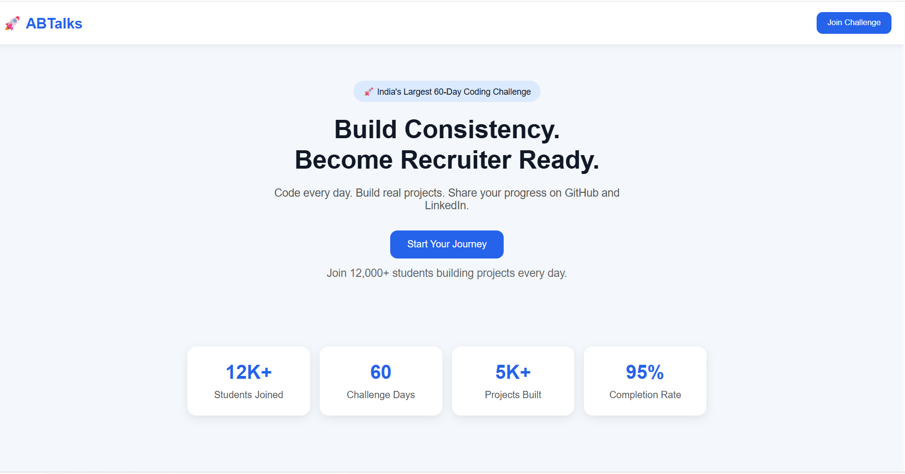
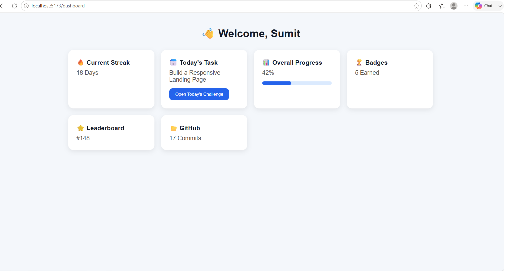
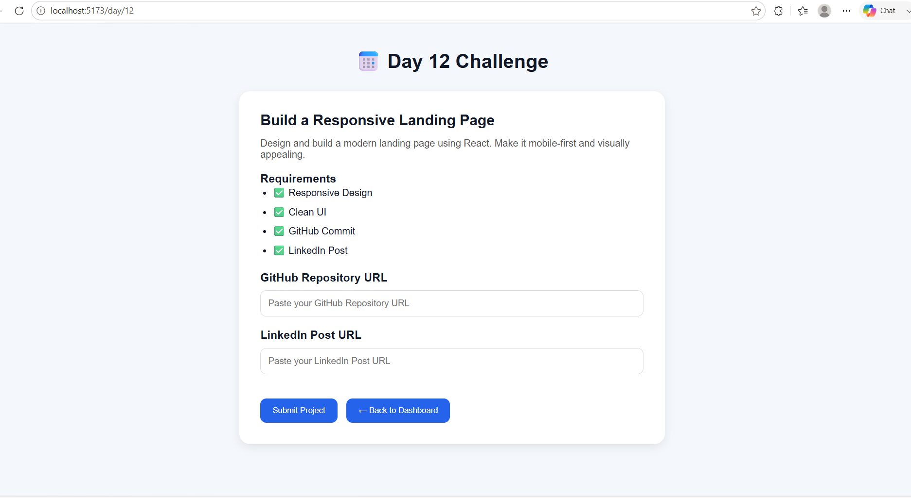

# 🚀 ABTalks Redesign – ViCodathon 2026

A modern, mobile-first redesign of the ABTalks platform created for **ViCodathon 2026**.

## 📌 Overview

This project redesigns the ABTalks coding challenge platform with a clean and responsive interface. It includes a landing page, student dashboard, and challenge page to improve the student experience.

## ✨ Features

- 📱 Mobile First Responsive Design
- 🏠 Modern Landing Page
- 📊 Student Dashboard
- 📅 Challenge Day Page
- 📈 Progress Tracking
- 🏆 Badges & Leaderboard
- ⚡ React Router Navigation
- 🎨 Clean UI

## 🛠️ Tech Stack

- React
- Vite
- React Router DOM
- CSS3

## 📂 Routes

| Route | Description |
|--------|-------------|
| `/` | Landing Page |
| `/dashboard` | Student Dashboard |
| `/day/12` | Challenge Day |

## 🚀 Installation

```bash
npm install
npm run dev
```

## 📸 Project Screenshots

### Landing Page



### Dashboard



### Challenge Page



## 🤖 AI Usage

This project was developed using AI-assisted development with ChatGPT.

## 👨‍💻 Author

**Sumit Awasthi**

Built for **ViCodathon 2026**